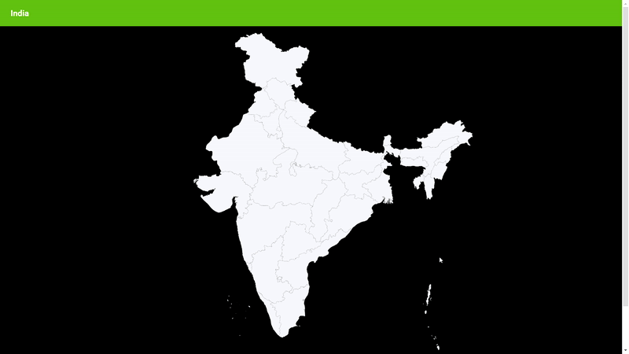

# React Region Selector for India

You can view the demo [here](https://amurto.github.io/react-india-region-selector/).



Overview
--------
This is a React component for hovering and selecting administrative areas from the map of India. The topojsons of the Indian map and each state with district boundary is stored in the topojsons folder. For creating maps of other administrative area levels and collecting shapefiles, visit http://projects.datameet.org/maps/.

Dependencies
------------
React library for custom selection and tooltip features on maps. For more info, visit this [site](https://www.react-simple-maps.io/).
```
npm i -S react-simple-maps@beta
```

Tooltip for showing labels of the selected area. The current demo includes states and district names. 
```
npm i react-tooltip
```
